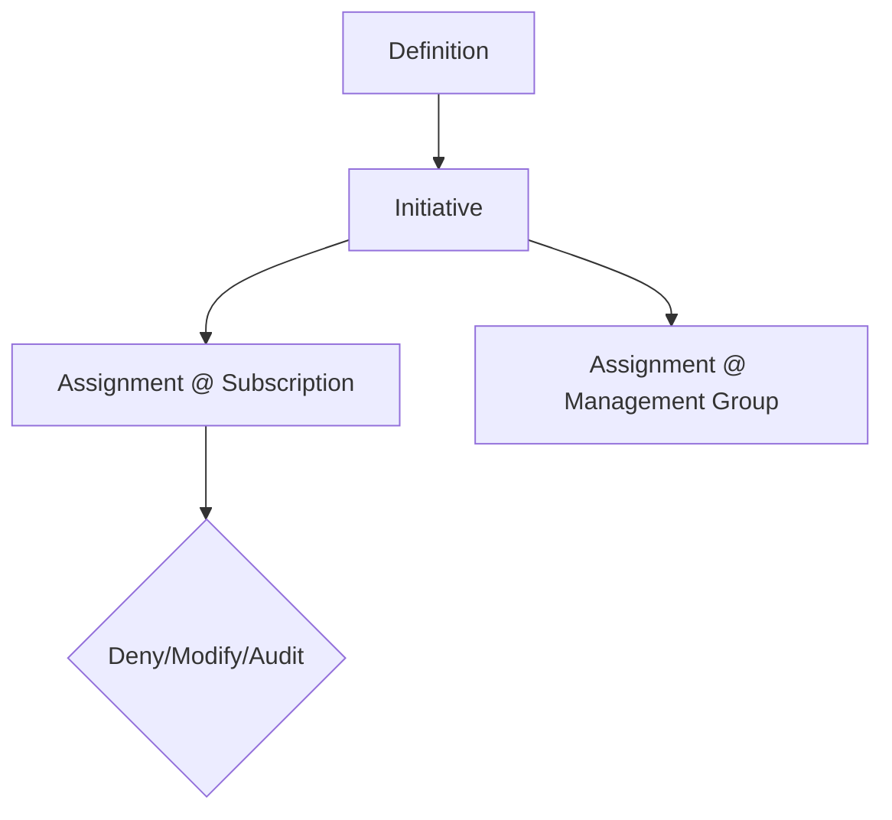

# Azure Governance Policy — Bicep
Guardrails as policy-as-code with subscription and management group assignments.

## Model


## Deploy
```bash
az deployment sub create   --template-file bicep/main.bicep   --parameters targetManagementGroup=contoso-platform enforcementMode=Default
```

## Examples
- Deny public IP on NICs
- Enforce tags and cost center
- Require LA agent
